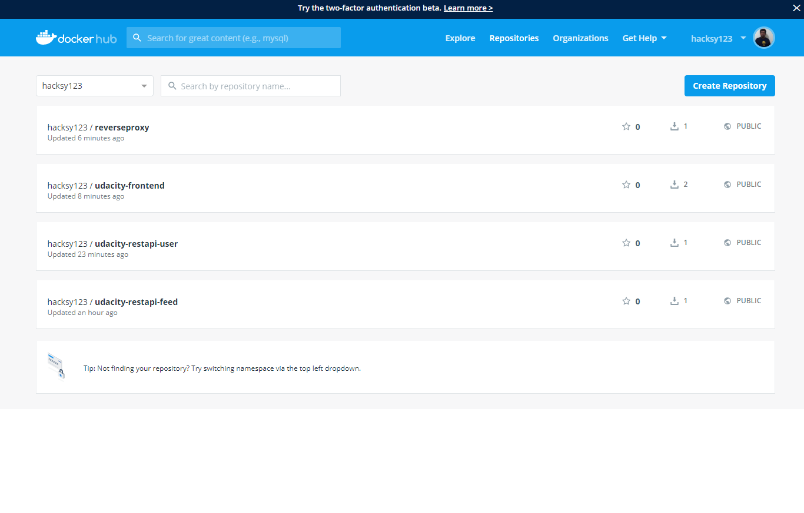
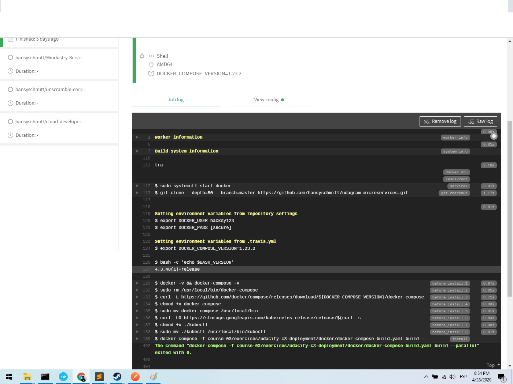
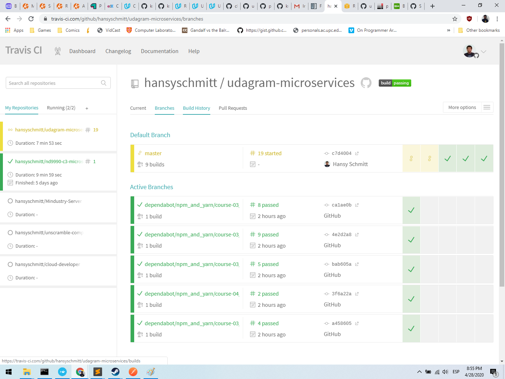
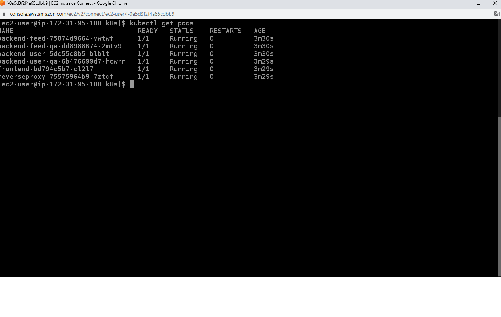
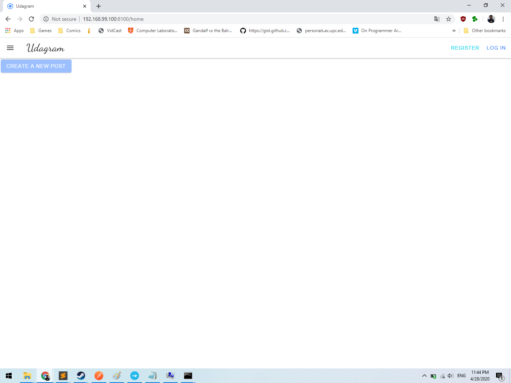

# Udagram 

Udagram is a simple cloud application developed alongside the Udacity Cloud Engineering Nanodegree. It allows users to register and log into a web client, post photos to the feed, and process photos using an image filtering microservice.

The project is split into three parts:
1. [The Simple Frontend](/udacity-c3-frontend)
A basic Ionic client web application which consumes the RestAPI Backend. 
2. [The RestAPI Feed Backend](/udacity-c3-restapi-feed), a Node-Express feed microservice.
3. [The RestAPI User Backend](/udacity-c3-restapi-user), a Node-Express user microservice.

## Installing Kubernetes in the AWS Instance

Installation based on https://github.com/kubermatic/kubeone/blob/3746055da2dfa0a747691927dffa9a66db54fd18/docs/quickstart-aws.md
and
https://github.com/kubermatic/kubeone/blob/master/docs/ssh.md

After that , loading the images  using

kubectl apply -f env-configmap.yaml

kubectl apply -f env-secret.yaml

kubectl apply -f backend-user-deployment.yaml
kubectl apply -f backend-user-service.yaml
kubectl apply -f backend-feed-deployment.yaml
 kubectl apply -f backend-feed-service.yaml
kubectl apply -f frontend-deployment.yaml
 kubectl apply -f frontend-service.yaml 
kubectl apply -f reverseproxy-deployment.yaml

kubectl apply -f pod-example/pod.yaml

kubectl get pod -o wide

# Image References
## DockerHub

## TravisCI

## kubectl get pod

## Application
On Windows Docker Toolbox does not point to localhost and instead uses a local ip - retrived with docker-machine ip -

